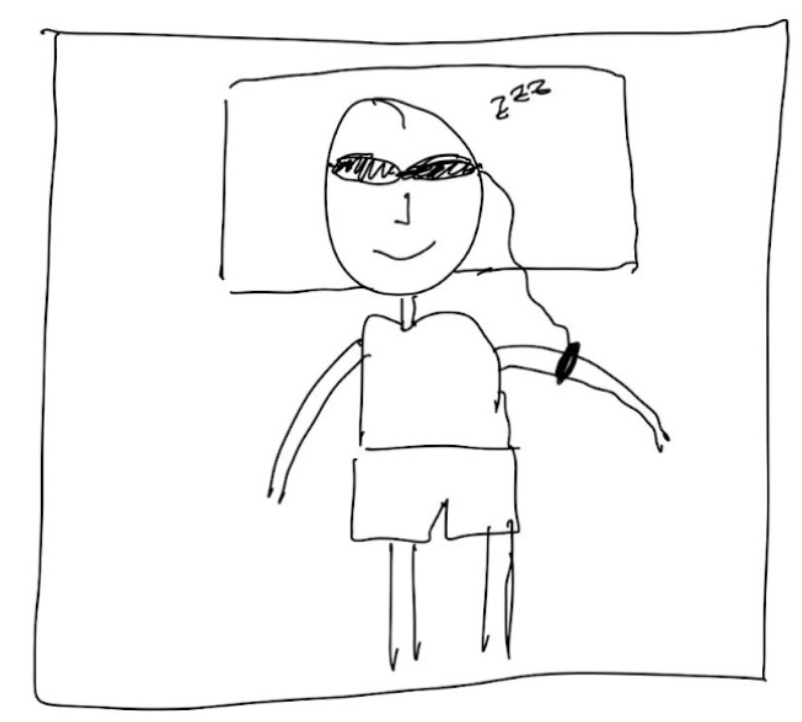
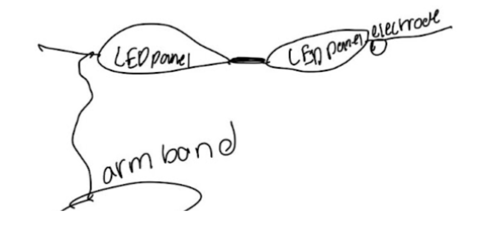
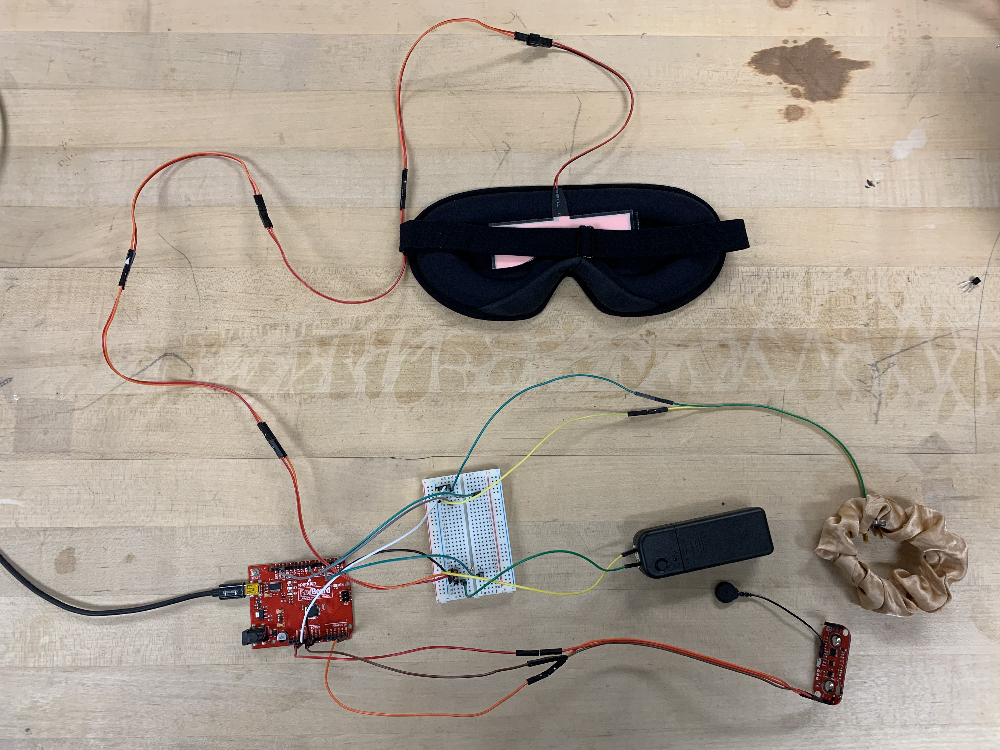
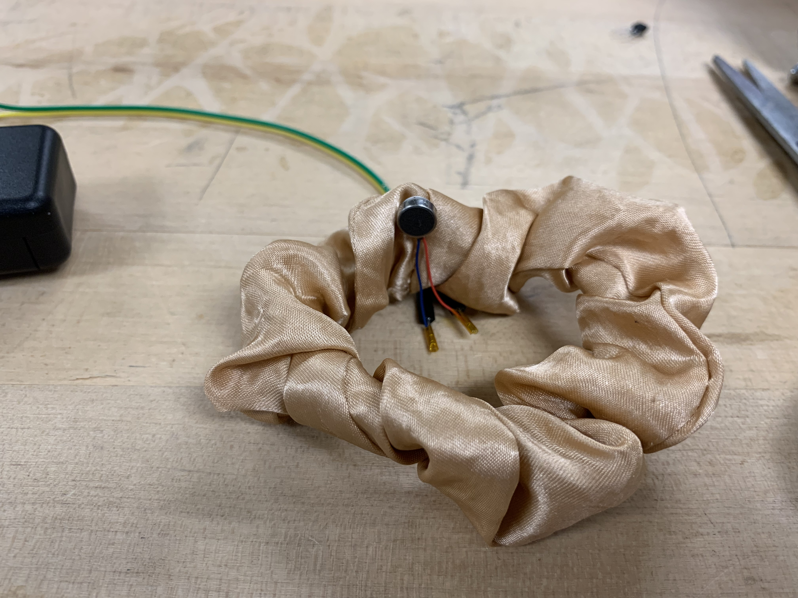
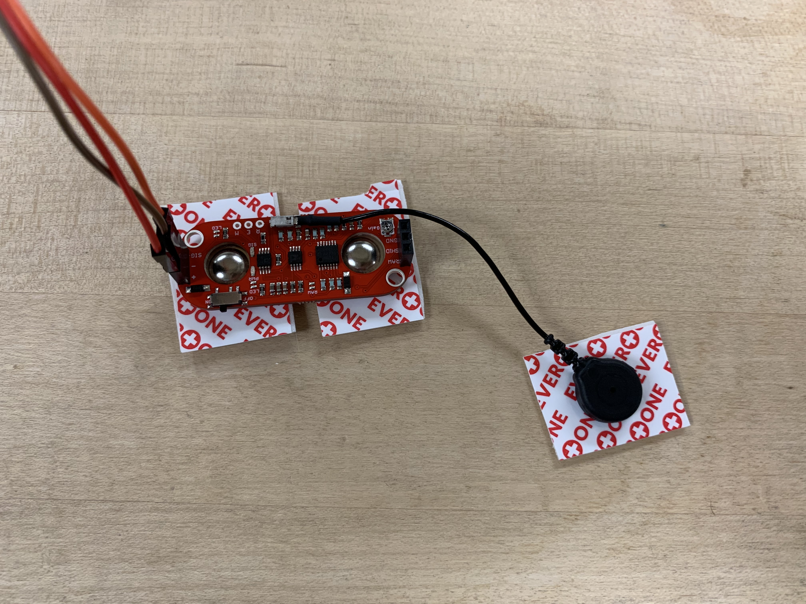
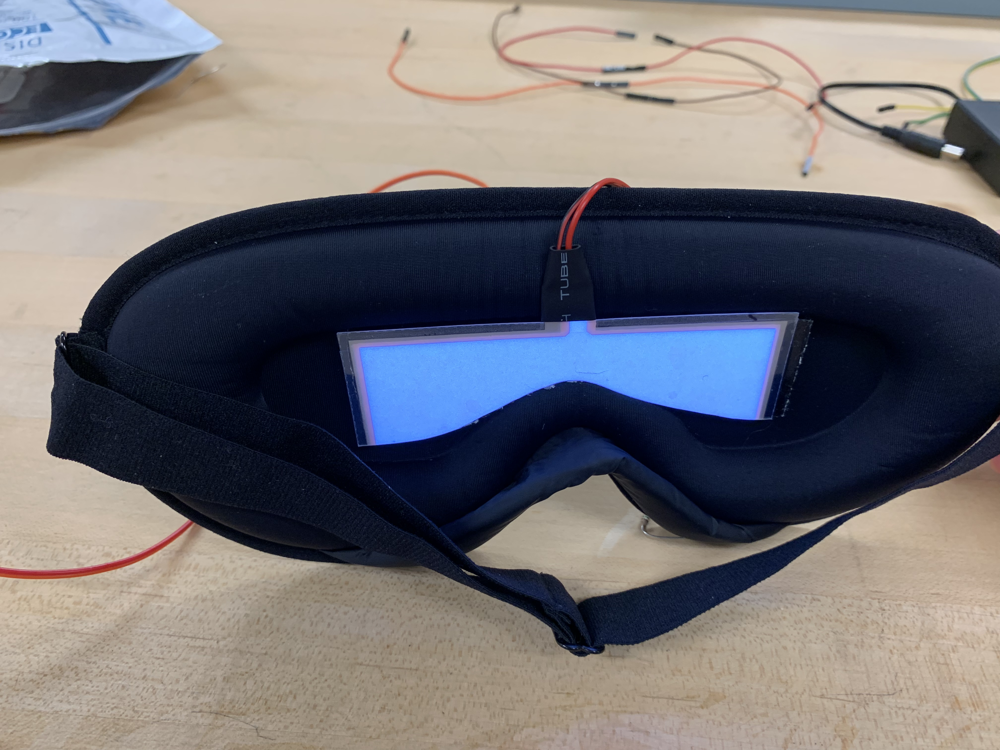
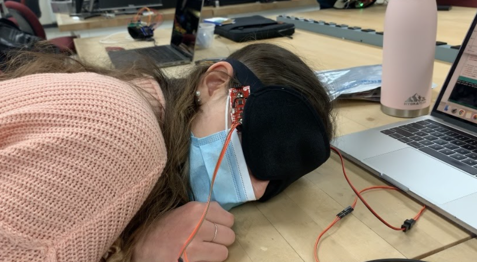

# Waker: A Smart Sleep Tool
#### Alex Gist, Maddie McClellan, Ariella Silver

## Executive Summary
### *Background and Motivation*
We wanted to create a device that would allow people to achieve better quality sleep. We identified sleep paralysis as a problem without a good solution. Sleep paralysis is a condition where an individual is fully conscious but has zero or limited motor function. We found that those who have sleep paralysis need a simple way to wake themselves up using the little motor function they have available to them. 

### *Problem*
When someone is experiencing sleep paralysis, they do not have full motor control over their bodies. Usually individuals can control a few body parts such as their eyes or feet. However, it is very difficult to wake up with this limited motor functioning. Thus, they are stuck in the state of sleep paralysis until their bodies naturally wake up. 

### *Idea: Method and Design*
We hoped to find a way to use the small movements that a person can access during sleep paralysis to trigger a response that would wake them out of the paralysis. We decided to use eye movements as the triggering user input. More specifically, when a person blinks three times within three seconds, we send a vibration and turn on a light in their eye mask.

### *Impact*
This device would allow people with sleep paralysis to get better sleep by assuring them that if they experience sleep paralysis, they have a reliable way to get woken up. This eliminates fear and anxiety associated with sleep paralysis and could potentially lead to improved sleep quality, especially if we are able to make the device smaller and more comfortable in the future. 

## Block Diagram and Visual Summary
A person wears the Waker device, which includes an eye mask and arm band. There is an electrode attached to their eye mask which senses blinking. When they blink three times in three seconds, the LED panel in the eye mask turns on as well as a vibromotor that is embedded in the arm band.

![blockdiagram] (images/blockdiagram.JPG)

## Components
* **Arduino RedBoard:** Where software is loaded, the point of connection for muscle sensor, and input/output creation
* **MyoWare Muscle Sensor Kit:** Records eye muscle movement and creates analog input for Waker
* **EL White Light Panel:** Placed inside of eye mask to light up when blinking is sensed
* **Vibromotor:** Placed on separate arm band to vibrate when blinking is sensed
* **Sleep Eye Mask:** Wearable component that houses light panel
* **Arm band:** Wearable component that houses the vibromotor
* **Breadboard / Circuit Components:** Controls the vibromotors and light panel using simple transistor setups
* **5V Battery & Inverter:** Powers the EL Light Panel

## Implementation
The major hardware components of our device are listed in the table of components above. The Arduino RedBoard serves as the central unit of the system and is programmed with a single file of code. The code contains three functions: vibrate_and_light(), setup(), and loop(). Loop() is the primary control function and runs on an infinite loop. It starts by reading samples from the ECG and records values over 30 millivolts. If three values over this threshold are recorded within three seconds, vibrate_and_light() is called. This function sets the vibromotor and light panel to HIGH. The setup() function is used to configure pins 3 and 7 to serve as an output for the vibromotor and LED panel. This function also initializes serial communication at 9600 bits per second. The vibromotor and light panel are wired to a breadboard with simple transistor setups. The vibromotor is connected to an arm band and the light panel is embedded in the eye mask, both worn by the user. 

## Pictures
This is our full device, including the arm band with vibromotor and sleep mask with ECG and light panel:

Close-up of arm band with vibromotor:

Close-up of ECG:

Close-up of sleep mask with light panel:

User wearing the device:

## Post-Mortem
* We learned that storing data is really difficult on a microprocessor without an external storage device like an SD card. It is much easier to simply store data from the last few seconds, and in this case, that was useful since this is the only data we need (we do not need data from the whole night’s sleep to detect our desired blinking event).
* We learned to narrow the scope of our project into something that is novel and useful, not necessarily composed of the most sensors and actuators. Initially, we were going to build a sleep tracker that had many different sensors, but such trackers already exist in many forms (e.g., Apple Watches). Waker is composed of just one sensor, but that is all that is necessary to detect sleep paralysis (and it is really the only way to do so). As a result of narrowing the scope of our project, we were able to build something unique and useful.
* We learned to document our progress better and take pictures and videos of working parts along the way. We had our system fully working, but when trying to change to a smaller breadboard, the LED panel no longer worked. Had we taken comprehensive notes, pictures, and videos of the setup and working product, we would have been able to save a lot of time and effort. 